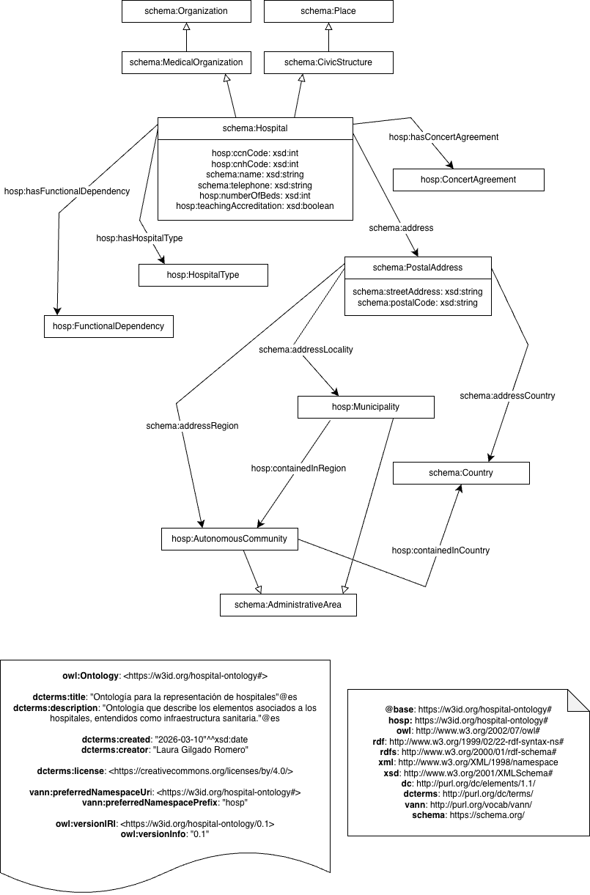

# Ontología para la representación de hospitales
Esta ontología describe los elementos asociados a los hospitales, entendidos como infraestructura sanitaria.

El modelo se ha construido a partir de datos abiertos publicados en [datos.gob.es](https://datos.gob.es/es/catalogo/e05070101-centros-y-servicios-del-sns-catalogo-nacional-de-hospitales) y proporcionados por el Ministerio de Sanidad en el Catálogo Nacional de Hospitales.

# Propósito y alcance de la ontología (ontology purpose and scope)
La ontología tiene como propósito representar información relativa a los hospitales tales como su nombre, ubicación, número de camas, tipo de centro y dependencia funcional, entre otros atributos.

El alcance de esta ontología se limita a la representación de datos de carácter administrativo o estructural. Quedan fuera del modelo aspectos relativos a la actividad clínica, los servicios ofrecidos u otra información asistencial.
Estos elementos podrían ser incorporados en futuras extensiones de la ontología.

# Prefijo y espacio de nombres (prefix and namespace)
El prefijo de esta ontología es hosp. Se publica en el espacio de nombres: https://w3id.org/def/salud/hospital#.

# Modelo conceptual (ontology conceptualization)

# Estructura del repositorio (reposity structure)
El repositorio contiene las siguientes carpetas:

| Folder | Description |
|--------|--------------|
| **diagrams/** | Stores diagrams and other resources representing the conceptual model of the ontology (e.g., class hierarchies, relationships). |
| **documentation/** | Stores the HTML or human oriented documentation of the ontology and related artefacts. |
| **examples/** | Includes examples that demonstrate how to instantiate or apply the ontology in real data scenarios. |
| **kos/** | Stores controlled vocabularies or KOS implementation, usually SKOS implementations in rdf. |
| **ontology/** | Contains the actual ontology implementation files in formats such as `.owl`, `.rdf`, `.ttl`, or `.jsonld`. |
| **requirements/** | Contains all documents used to define the ontology’s requirements: data example, competency questions, functional requirements, use cases, etc. |
| **shapes/** | Contains the SHACL shapes used to define and validate ontology constraints. |

# Mantenimiento y evolución (maintenance and evolution)
To manage those incidents or suggested improvements with respect to the vocabulary, we recommend you to follow the guides provided in [Issues Management](https://github.com/nombre-repositorio/wiki/issues-management) to generate an issue (work in progress).
